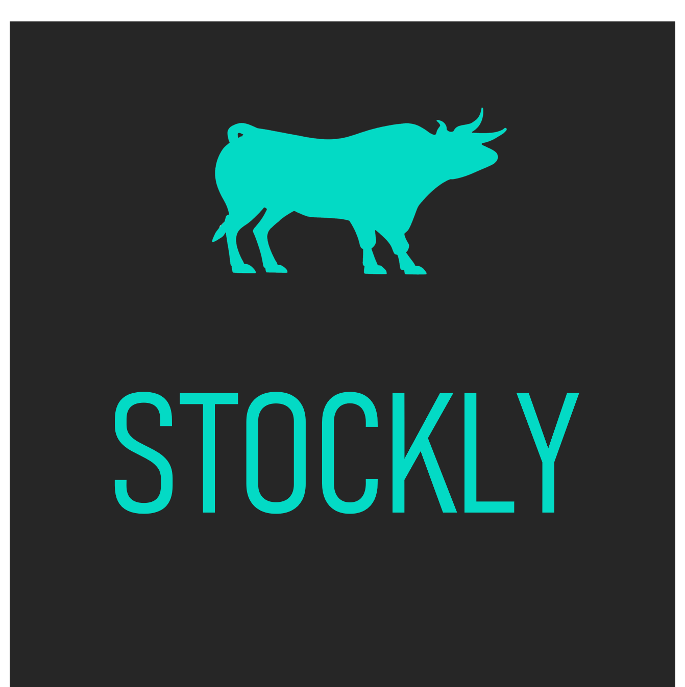
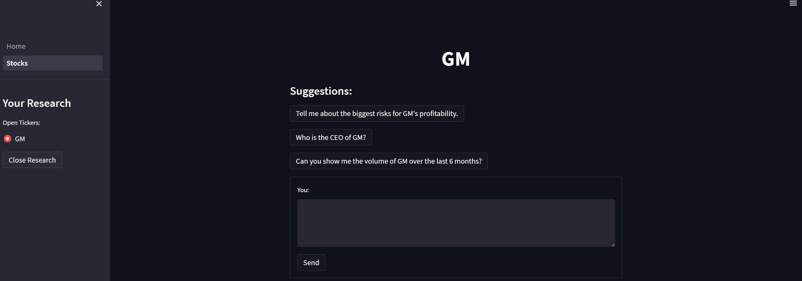
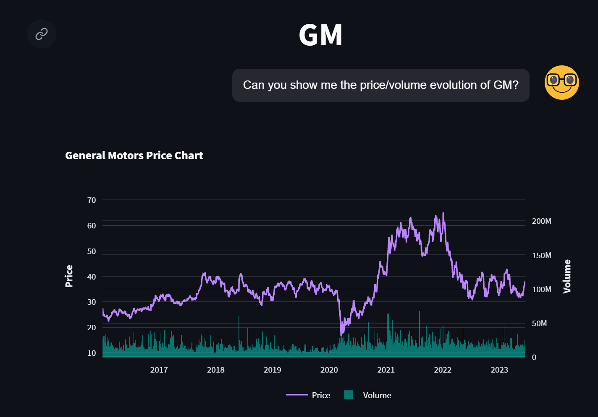
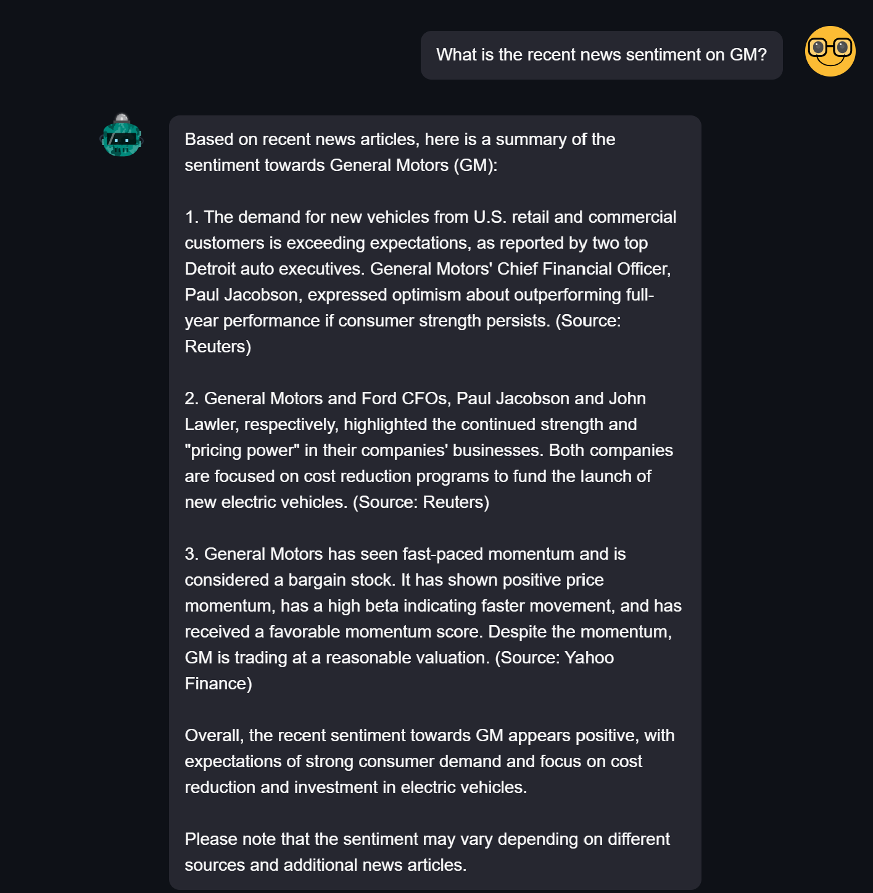
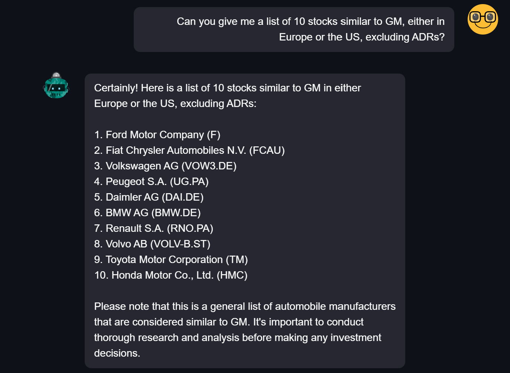
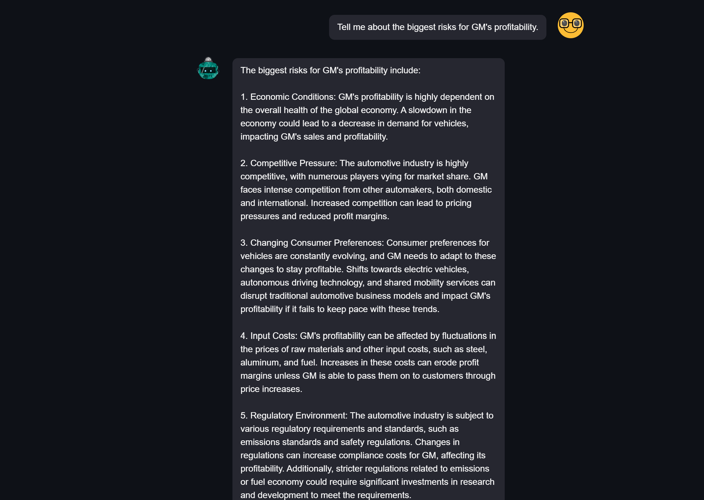

# Cal Hacks 2023 - Stockly

MVP for a Retail Investment Advisor Powered by LLMs

# Key Problems Tackled

- Large amount of textual data
  - News data
  - Dense financial reports
- Large amount of numerical data
  - Financial time series are notoriously noisy
  - Requires good understanding of statistics & time series methods
- Quant finance models are gate kept
  - The average retail investor does not have the resources or know-how to utilize advanced recommendation & asset allocation models
 
# Key tools used

- Python
- GPT (current LLM used in the product)
- langhcain (support with large context windows)
- streamlit (user interface)
- pandas/numpy/plotly/seaborn (data visualization)
- (TBD) scikit-learn/pytorch (needed in the future to suport dynamic quant models)

# Product screenshots

## Landing Page

## Custom Price/Volume Chart

## News Sentiment

## Peer Finder

## Risk Analysis on SEC Filings

